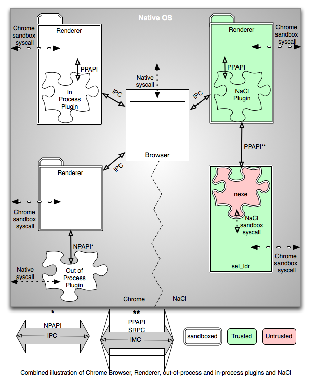
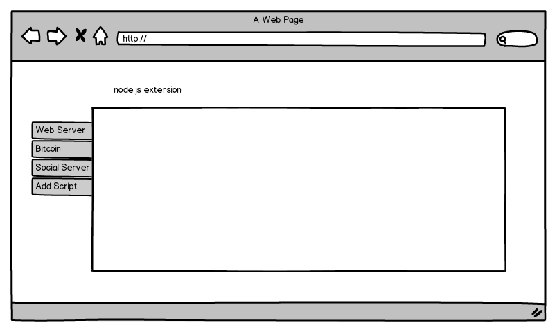

Node.js in the browser
=========

---

Thomas Davis
---------

- [http://thomasdav.is](http://thomasdav.is)
- [http://cdnjs.com](http://cdnjs.com)
- [http://backbonetutorials.com](http://backbonetutorials.com)

Slide Repository
--------------------------------

- [https://github.com/thomasdavis/browser-node-slides](https://github.com/thomasdavis/browser-node-slides)

---

Browserify
========

[https://github.com/substack/node-browserify](https://github.com/substack/node-browserify)

Make node-style require() work in the browser with a server-side build step, as if by magic!
    
    !javascript
    // use relative requires
    var foo = require('./foo');
    var bar = require('../lib/bar');

    // or use modules installed by npm in node_modules/
    var domready = require('domready');

    domready(function () {
        var elem = document.getElementById('result');
        elem.textContent = foo(100) + bar('baz');
    });

One way of taking advantage of the NPM repository
** Limited **

---

Running the node.js process inside an extension
========

---

Benefits
========

- Have node.js and access to the entire NPM repository inside a browser extension
- node.js is only ~6.6mb to package inside of an extension
- One click install of browser extensions
- Interact with the DOM, the browsers native calls and node.js all at once
- Automatically sync your extensions across your computers

Cons
========

- Security

---

How can I do this?!?
========

- No formal implementations
- I found only two repos (1 for chrome/ 1 for firefox)
- Chrome [https://github.com/danielconnor/chrome-node](https://github.com/danielconnor/chrome-node)]
- Firefox [https://github.com/robhawkes/node-extension](https://github.com/robhawkes/node-extension)
- Many different approaches (NPAPI, NACL, PPAPI, nsIProcess)

---

Firefox Extension with nsIProcess
========

Using Rob Hawkes firefox implementation.

Follow his easy [instructions](http://rawkes.com/articles/running-node.html).

---

Demo
========

Please work

---

Development Extension
========

myImage

---

Multiplayer games
========

Instead of using native websockets etc

When people install your multiplayer games, just bundle the node.js binary and take advantage of the enormous amount of pre existing libraries.

---

Bitcoin in the browser
========

[https://github.com/jb55/node-bitcoin](https://github.com/jb55/node-bitcoin)

Using node.js bitcoin servers you could automatically start reaping when ever you are on a browser somewhere etc etc

    !javascript
    var bitcoin = require('bitcoin');
    var client = new bitcoin.Client('localhost', 8332, 'username', 'password');

---

Tent.io
========

[https://tent.io/](https://tent.io/)

Tent is a protocol for social networking.

Tent is open, decentralized, and built for the future. Tent changes everything.

## Getting Started

Tent allows every user to run their own server, but like email and the web, most users will use a hosting service to handle it.

1. Users who want to run their own server should look at tentd, the current reference server implementation.
2. Alternatively, Tent.is offers one-click Tent hosting.

## How to distribute a decentralized server to noobs?!?!?

_One click install browser extensions_

---

Ideas
========

Anyone have any cool ideas they could pull off with a webserver in the browser?

## FireBreath

- Easily compile extensions that work on all browsers and platforms using FireBreath's glue code
